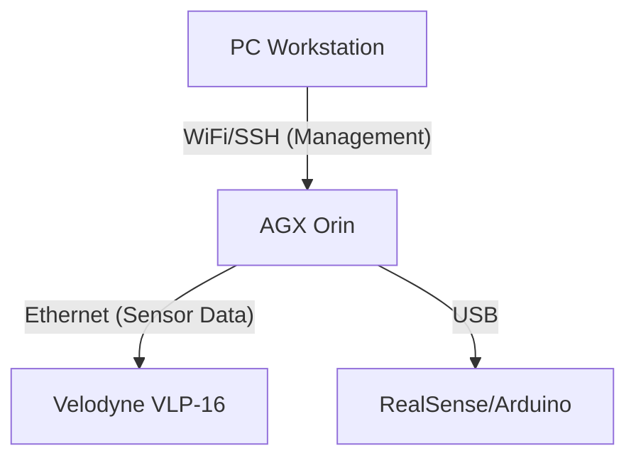

This is a revised, secure, and professional `README.md` for your GitHub repository. It removes hardcoded IPs and generalizes the instructions so that anyone (including your future self) can follow them without security risks.

### Key Changes:

1.  **Replaced Hardcoded IPs**: Changed specific IPs like `192.168.200.112` to `<AGX_IP>` placeholders.
2.  **Configuration Section**: Added a step to copy `.env.example` to `.env.agx`, emphasizing that credentials should not be committed.
3.  **General Hardware Setup**: Generalized the LiDAR setup instructions to explain the subnet logic rather than just providing a single static IP.

-----

# AGX Hybrid Navigation System (ROS 1 Noetic + ROS 2 Humble)

  

This is a **Docker-based** hybrid navigation system designed specifically for the **NVIDIA Jetson AGX Orin (JetPack 6)** platform. The project adopts modern DevOps workflows, enabling cross-compilation on a PC and one-click remote deployment to the edge device.

## 🏗️ System Architecture

The project utilizes a **dual-track architecture** with containerized isolation:

  * **`control` (ROS 1 Noetic)**: Handles low-level hardware drivers (Velodyne LiDAR, RealSense, Arduino) and 3D SLAM (HDL-Graph-SLAM).
  * **`planning` (ROS 2 Humble)**: Handles high-level path planning (Nav2, Costmap) and future AI/RL extensions.
  * **`bridge`**: Uses `ros1_bridge` to enable seamless communication between legacy and modern ROS versions.
  * **`foxglove`**: A lightweight WebSocket-based visualization server, replacing the heavy RViz client.

### 🌐 Network Topology

The system uses a **Dual-NIC Strategy** to separate management traffic from high-bandwidth sensor traffic:



  * **Management Network (`wlan0`)**: Used for SSH, Docker Deploy, and Foxglove Monitoring.
  * **Sensor Network (`eth0`)**: Dedicated to LiDAR UDP traffic (e.g., `192.168.1.x`).

-----

## 📂 Directory Structure

```text
agx_ros/
├── README.md                   # Project Documentation
├── docker-compose.yaml         # Core Configuration (Services & Networks)
├── docker-compose.override.yml # [GitIgnore] Dev Mode Config (Volume Mounts)
├── .env.agx                    # [GitIgnore] AGX Env Vars (ARM64, L4T Base)
├── navigation/                 # [ROS 1] Control Service
│   ├── Dockerfile              # Multi-Arch (x86/ARM64) support
│   ├── entrypoint.sh           # Smart entrypoint (Detects Dev/Prod mode)
│   └── src/                    # Source code: hdl_graph_slam, velodyne_driver, etc.
├── planning/                   # [ROS 2] Planning Service
│   ├── Dockerfile              # Based on dustynv L4T (CUDA Enabled)
│   ├── entrypoint.sh
│   └── src/                    # Nav2 Config, Python Nodes
├── bridge/                     # [Bridge] ROS1-ROS2 Bridge
│   └── Dockerfile
└── foxglove/                   # [Viz] Foxglove Bridge
    └── Dockerfile
```

-----

## 🚀 Quick Start

### 1\. Prerequisites

  * **PC Workstation**:
      * Docker Desktop / Engine (with Buildx support)
      * VS Code (Remote - SSH extension)
      * Foxglove Studio (Desktop App recommended)
  * **AGX Orin**:
      * JetPack 6.0+
      * Docker Engine

### 2\. Configuration Setup

Before deploying, create the environment configuration file. Do not commit `.env.agx` to GitHub if it contains sensitive info.

```bash
# Copy example to production config
cp .env.example .env.agx

# Edit .env.agx with your specific settings (e.g., ARCH=linux/arm64)
```

### 3\. Setup Remote Connection (PC -\> AGX)

Configure the Docker Context on your PC to enable remote deployment.

```bash
# 1. Setup SSH Key-based Authentication
# Replace <AGX_IP> with your actual AGX WiFi IP (e.g., 192.168.200.112)
ssh-copy-id systemlabagx@<AGX_IP>

# 2. Create Docker Remote Context
docker context create agx_remote --docker "host=ssh://systemlabagx@<AGX_IP>"

# 3. Verify Connection
docker --context agx_remote info
```

-----

## 🛠️ Development Workflow

We support two distinct workflow modes: **Development Mode (Dev Mode)** and **Production Deployment (Prod Mode)**.

### Mode A: Development Mode (Hot Reload)

*Best for: Frequent code changes, debugging, and parameter tuning.*

1.  Connect to AGX via **VS Code Remote SSH**.
2.  Ensure `docker-compose.override.yml` exists in the project root (handles volume mounting).
3.  Start the environment:
    ```bash
    # Run on AGX Terminal
    docker compose up -d
    ```
4.  **After modifying code**:
      * **Python**: Save changes and restart the node/container.
      * **C++**: Compile manually inside the container.
        ```bash
        docker exec -it control bash
        # Inside container: cd /root/hdl_ws && catkin_make
        ```

### Mode B: Remote Deployment (Buildx Remote)

*Best for: Environment setup, full compilation, and final release. Compiles on PC, runs on AGX.*

Run the following command on your **PC** to build, package, and deploy the code to the AGX:

```bash
# --context: Target the remote AGX
# -f: Use only the main config (ignore dev overrides for a clean environment)
# --build: Force rebuild of images

docker --context agx_remote compose --env-file .env.agx -f docker-compose.yaml up --build --force-recreate -d
```

> **Note**: In this mode, containers use the code baked into the Docker Image. Local source files on the AGX are **not** mounted.

-----

## 📊 Visualization (Foxglove Studio)

This project uses **Foxglove Studio** instead of RViz for remote monitoring.

1.  **Open Foxglove Studio** (On PC).
2.  **Connection Setup**:
      * Source: `Foxglove WebSocket`
      * URL: `ws://<AGX_IP>:8765` (Replace `<AGX_IP>` with your AGX WiFi IP)
3.  **Common Topics**:
      * `Map`: `/globalmap` (PointCloud2) - *Note: Latched topic, may require node restart to appear.*
      * `LiDAR`: `/velodyne_points` (PointCloud2)
      * `Path`: `/global_path` (MarkerArray)
      * `Robot`: `/tf`

> **Tip**: If connected but no data appears, check if the Topic QoS settings in Foxglove are set to **Reliable**.

-----

## 📝 Hardware Notes

### Velodyne LiDAR Setup

The LiDAR uses Ethernet UDP. You must configure the AGX's wired interface (`eth0`) to a separate subnet to avoid conflicts with the WiFi management network.

  * **LiDAR IP**: `192.168.1.201` (Default Factory IP)
  * **AGX eth0 IP**: Configure to `192.168.1.x` (Manual Static IP, e.g., `192.168.1.77`)
  * **Docker Port Mapping**: `2368:2368/udp` is required in `docker-compose.yaml`.

-----

## 🗓️ Roadmap

  - [x] **Phase 1**: Establish AGX JetPack 6 Hybrid Architecture (ROS 1 + ROS 2)
  - [x] **Phase 2**: Implement Buildx Remote Deployment Workflow
  - [x] **Phase 3**: Integrate Hardware Drivers (Velodyne, RealSense) & Docker Network Passthrough
  - [x] **Phase 4**: Replace RViz with Foxglove Studio for Web-based Viz
  - [ ] **Phase 5**: Deploy Nav2 Stack and bridge with SLAM maps
  - [ ] **Phase 6**: Integrate VLM/RL models into ROS 2 nodes for AI Navigation

**Maintainer**: NYCUSystemLab