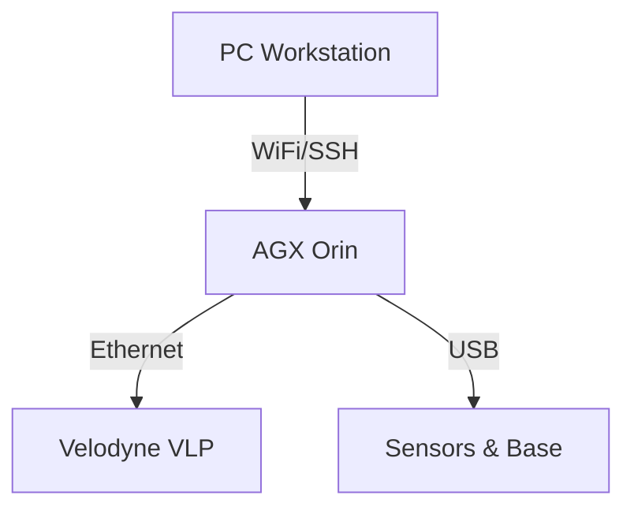

# AGX ROS 2 AI Navigation System

  

This is a modern **Docker-based** AI navigation system designed for the **NVIDIA Jetson AGX Orin (JetPack 6)**. It utilizes a unified ROS 2 architecture combined with state-of-the-art AI models for vision, natural language, and autonomous planning. The project adopts simple, dynamic Makefile-driven deployment out-of-the-box.

## 🏗️ System Architecture (Containerized)

The project leverages Docker Compose to isolate and manage distinct capabilities. All services automatically share host network or IPC when running in AGX mode.

| Service | Role & Description |
| --- | --- |
| **`planning`** | **[ROS 2 Core]** Hardware drivers (LiDAR, RealSense, Car base), Nav2 stack, slam_toolbox, and high-level control nodes. |
| **`foxglove`** | **[Visualization]** Runs a high-performance WebSocket server for remote visualization, replacing heavy local GUIs like RViz. |
| **`vlm`** | **[Isaac ROS]** GPU-accelerated VSLAM, object detection, and hardware-accelerated ROS 2 nodes. |
| **`nanollm`** | **[Nano LLM]** Local Large Language Model interactions using Jetson's optimized inference. |
| **`cosmos`** | **[Cosmos-Reason]** Advanced reasoning modules powered by Cosmos-Reason2. |

### 🌐 Network Topology


```mermaid
graph TD
    PC[PC Workstation] -- WiFi/SSH --> AGX[AGX Orin]
    AGX -- Ethernet --> LiDAR[Velodyne VLP]
    AGX -- USB --> Sensors[Sensors & Base]
```

## 🚀 Quick Start (Dynamic Makefile)

We provide a streamlined `Makefile` that wraps Docker Compose. **If you run commands without specifying a service, an interactive menu will dynamically pop up!**

### Core Commands

| Command | Description |
| --- | --- |
| **`make up [s=name]`** | Start services. Example: `make up` (pops up menu) or `make up s=planning`. |
| **`make down [s=name]`** | Stop and remove running services. |
| **`make build [s=name]`**| Build Docker images locally. |
| **`make rebuild [s=name]`**| Force rebuild and recreate containers. |
| **`make logs [s=name]`** | View container logs in real-time. |
| **`make ps`** | List status of all docker-compose containers. |
| **`make join [c=name]`** | Open an interactive bash shell inside a running container. |
| **`make clean`** | Stop and completely remove all containers and images. |
| **`make dashboard`** | Launch the centralized Web Dashboard on port 8080. |

> **Interactive Menu Feature**: Operations like `make up`, `make down`, and `make join` will automatically parse your `docker-compose.yaml` (or `docker ps`) and display a numbered list. You can select single or multiple services (e.g., `1 3`) or press `a` for **All**.

## 📊 Visualization (Foxglove Studio)

We use **Foxglove Studio** instead of RViz for remote monitoring over the network.

1.  **Open Foxglove Studio** on your PC.
2.  **Connection Setup**:
      * Source: `Foxglove WebSocket`
      * URL: `ws://<AGX_IP>:8765`
3.  **Common Topics**:
      * `Map`: `/map`
      * `Velodyne`: `/velodyne_points`
      * `TF`: `/tf`

> **Tip**: Ensure QoS settings match (usually **Reliable** or **Best Effort** depending on the topic).

## 📝 Hardware Notes

### Velodyne LiDAR Setup
The LiDAR uses Ethernet UDP. Configure the AGX's wired interface (`eth0`) statically.
  * **LiDAR IP**: `192.168.1.201` (Default)
  * **AGX eth0 IP**: `192.168.1.x` (Manual Static IP)

## 👥 Remote Deployment Context (PC -> AGX)

If developing on a PC, you can link your Docker CLI directly to the AGX Engine over SSH without compiling locally:

```bash
# 1. Share SSH keys
ssh-copy-id systemlabagx@<AGX_IP>

# 2. Create Docker context
docker context create agx_remote --docker "host=ssh://systemlabagx@<AGX_IP>"

# 3. Switch context to AGX
docker context use agx_remote

# 4. Use Makefile remotely
make up
```
*(The Makefile will Auto-Detect the `agx` context and load `.env.agx` / `docker-compose.yaml` accordingly).*

---
**Maintainer**: NYCUSystemLab